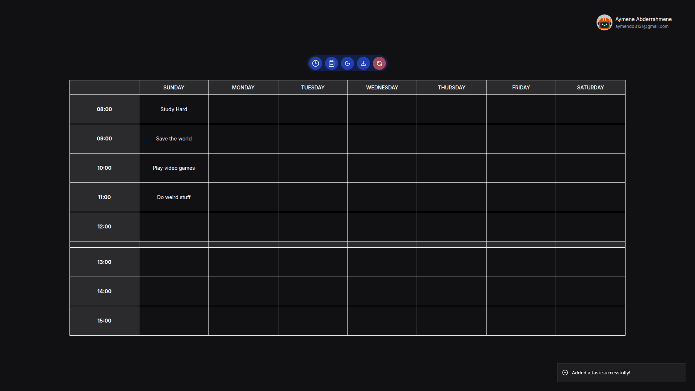

# Stedule

Stedule is a task scheduling app where you can create weekly schedules for organization.

[](https://stedule.vercel.app/)
[](LICENSE)



## Tech Stack

- **Language:** TypeScript
- **Framework:** Next.js
- **Styling:** Tailwind CSS, shadcn/ui
- **Form Validation:** Zod + react-hook-form
- **Printing:** react-to-print
- **Backend Database:** PostgreSQL + Prisma ORM
- **Frontend Database:** IndexedDB + Dexie.js
- **Authentication:** Better Auth
- **Testing:** Vitest, Playwright

## Features

- **Simple:** only the features you need with no unnecessary bloat.
- **Offline-Friendly:** you can use the app without creating an account thanks to IndexedDB which acts like a client-side database.
- **Online-Friendly:** you can use save your data across devices by creating an account.
- **Printing:** you can save the schedule as a PDF and print it.
- **Accessiblility:** the app supports both light and dark modes, high-contrast colors, reduced motion, and forced colors mode for user comfortability.
- **Secure:** the app is built with personal data security in mind.
- **Client-Side Validation:** validate user input on the client-side for instant user feedback and reducing server requests, saving server costs and improving UX.
- **Server-Side Validation:** validate and sanitize user input on the server-side for data security and integrity.

## Engineering Decisions

### Frontend

- **TypeScript:** type safety and powerful IDE support.
- **Next.js:** component-based framework for highly interactive UIs, offering exceptional IDE support and type safety when combined with TypeScript.
- **shadcn/ui:** beautiful, accessible, and easy-to-edit components. It also comes with CSS variables to easily add support for both light and dark modes.
- **Zod:** rich-feature library with a powerful API to validate user input at runtime.
- **react-hook-form:** client-side validation library for instant user feedback and better UX.
- **react-to-print:** a specialized React printing library for printing specific UIs components instead of the whole page.
- **IndexedDB:** browser built-in asynchronous client-side storage for complex data handling.
- **Dexie.js:** a lightweight IndexedDB wrapper library that provides a simple API to manipulate IndexedDB.

### Backend

- **Next.js:** use Next.js backend features (RSC, proxy, and server actions) for a unified TypeScript codebase and simple, free hosting.
- **Prisma ORM:** abstract raw PostgreSQL for simple, type-safe database operations directly in TypeScript, improving the developer experience.
- **Better Auth:** a powerful TypeScript authentication framework with a simple API for self-hosted authentication.

### Testing

- **Vitest:** for unit testing.
- **Playwright:** for end-to-end (E2E) testing.

## Getting started

### 1. Clone Repository

To use the project locally, run the following commands:

```bash
git clone https://github.com/AymeneBahmed/stedule.git
cd stedule
# use --legacy-peer-deps to avoid Github Actions dependency installation error
npm install --legacy-peer-deps
```

### 2. Set Environment Variables

Before running the development server, make sure to replace the placeholder values in `.env.example`.

### 4. Initialize Database

```bash
npx prisma db push
```

### 5. Run Development Server

```bash
npm run dev
```

## Run Vitest tests

```bash
npm run test
```

## Run Playwright Tests

If you're using Debian/Ubuntu based distros, first install Playwright OS-specific dependencies:

```bash
npx playwright install-deps
```

Then, you can just run tests with the following command:

```bash
npx playwright test
```

If you're NOT using a distro that uses `apt`, the best solution is to run the tests inside an **Ubuntu Container** using `distrobox`.  
For example, with `dnf`:

```bash
# Install distrobox and podman
sudo dnf install -y distrobox podman

# Install Ubuntu v24.04 image
distrobox create -i ubuntu:24.04 --name playwright-env\n

# Now you can run Debian/Ubuntu commands such as apt inside the Ubuntu Container
distrobox enter playwright-env
```
